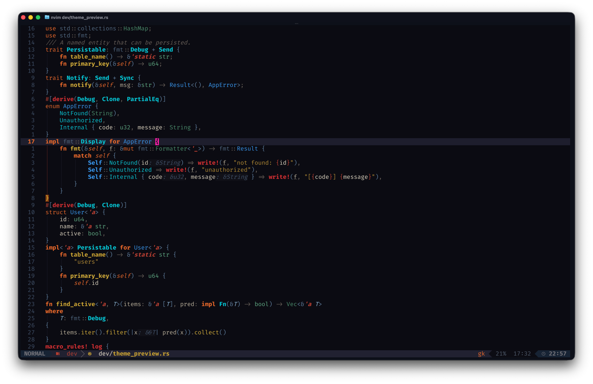

# wolf359.nvim

A deep-space-ish vibe-coded Neovim colorscheme, optimized for Rust.

Dark backgrounds, rocket orange keywords, cosmonaut blue types, radar cyan traits.
Extra care for rust-analyzer semantic tokens, lifetimes, stdlib structs, and derive macros.

Name inspired by the [`Wolf359`](https://wolf359.fm/) audiodrama,
highly recommend it ;)

## Preview



## Requirements

- Neovim 0.12+
- A terminal with true color support

## Installation

### lazy.nvim

```lua
{
  "ShiraiEd/Wolf359_nvim_rust_theme",
  lazy = false,
  priority = 1000,
  config = function()
    vim.cmd("colorscheme wolf359")
  end,
}
```

### With LazyVim

```lua
-- lua/plugins/theme.lua
return {
  { "LazyVim/LazyVim", opts = { colorscheme = "wolf359" } },
  { "ShiraiEd/Wolf359_nvim_rust_theme", lazy = false, priority = 1000 },
}
```

### Manual

Copy `colors/wolf359.lua` into `~/.config/nvim/colors/` and add to your config:

```lua
vim.cmd("colorscheme wolf359")
```

## Palette

| Role | Color |
|------|-------|
| Background | `#0B0B13` |
| Foreground | `#DDD5C0` |
| Keywords | `#E86820` orange |
| Types / structs | `#3A98F0` blue |
| Traits | `#00C8D8` cyan |
| Functions | `#C8A020` gold |
| Primitives (`i32`, `bool`) | `#60A880` moss |
| Lifetimes | `#B84030` copper |
| Strings | `#B08828` amber |
| Numbers | `#00BCA0` teal |
| Macros / errors | `#D03030` red |

## License
MIT
